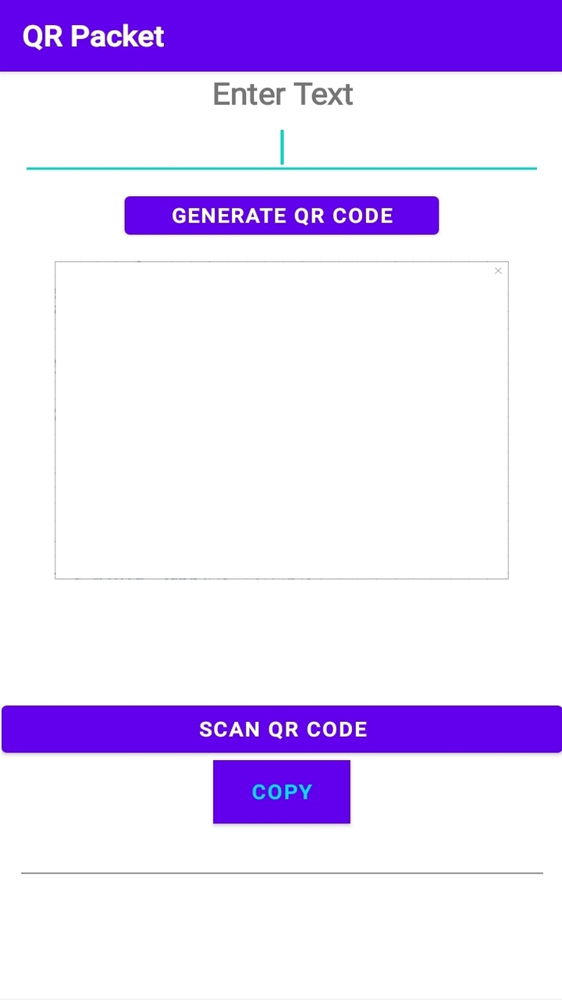
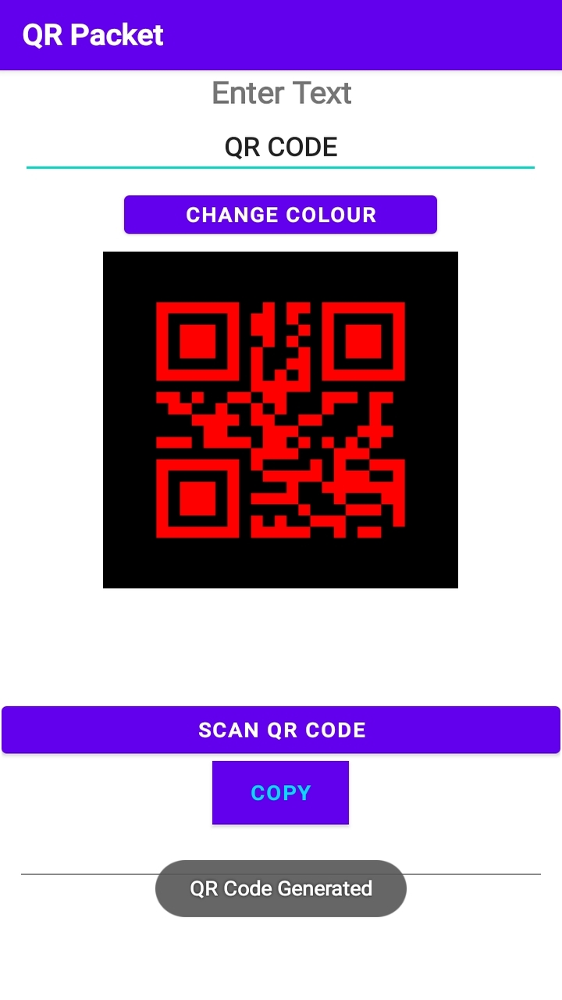
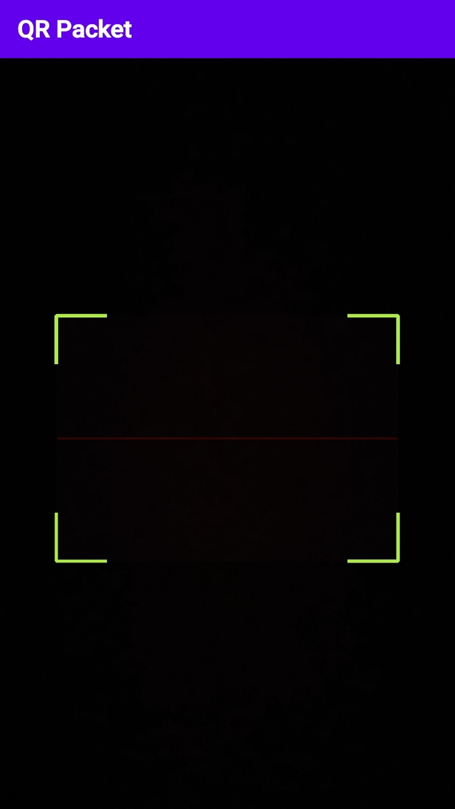
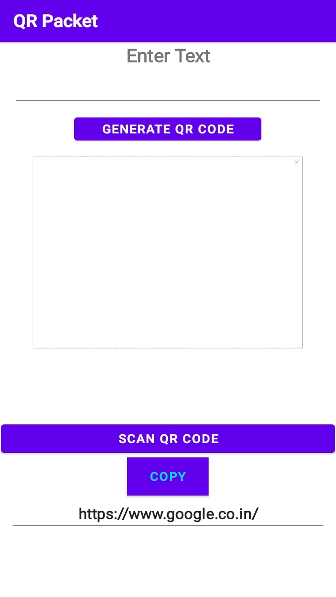

# QR-Code-Scanner-and-Generator
Android App made using Java for QR code scanning and generation

The above app has been made using Java in Android Studio.

You can access the app files from the Zip files.

The ```MainActivity.Java```, ```scannerView.Java``` and the ```.xml``` files are provided for the reference.

The ```build.gradle``` file is provided for all the reference for necessary libraries.

The external dependencies can be accessed from here

https://www.dropbox.com/sh/ydk7rdje190ew2m/AAAja6z6VxPFBSjd9gQWqZF0a?dl=0

You can download and install the app using the above ```.apk``` file








